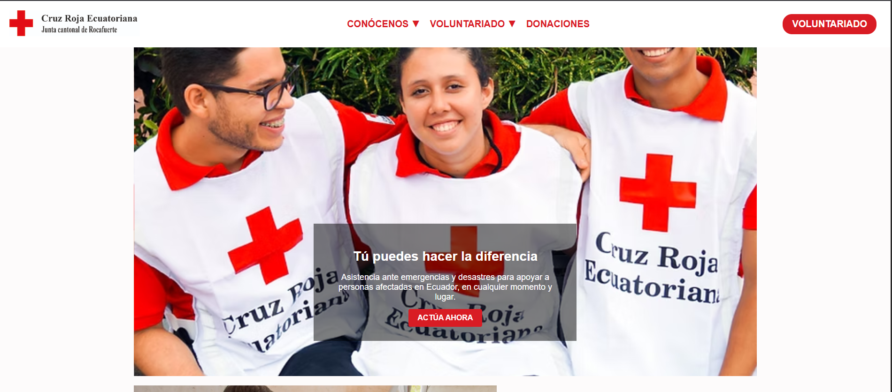
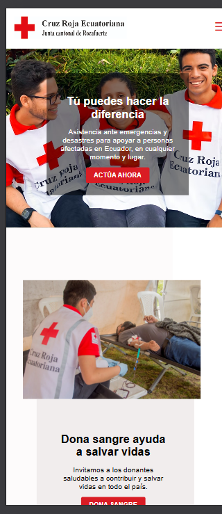

🚑 Cruz Roja - Junta Cantonal Rocafuerte
Este repositorio contiene el desarrollo web de la Junta Cantonal de la Cruz Roja en Rocafuerte. El sitio web presenta información institucional, servicios, contacto y más, con un diseño moderno y accesible.

📁 Estructura del Proyecto
index.html: Página principal del sitio.

index.css: Estilos personalizados.

imagenes/: Carpeta con recursos gráficos (logotipos, banners, etc.).

js/: Funcionalidades dinámicas con JavaScript (menús, interacción).

🚀 Tecnologías Utilizadas
HTML5

CSS3

JavaScript

Diseño adaptable (responsive design)

👨‍💻 Autor
Jordy Javier Chichanda Mendez

📧 jordimendez1999@gmail.com

📄 Licencia
Este proyecto es de uso académico. Para otros fines, por favor consultar al autor.
